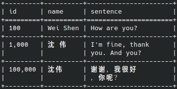
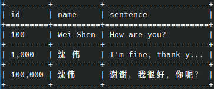

# stable - streaming pretty text table

If you just need an executable tool to format tables, please use `csvtk pretty`
([code](https://github.com/shenwei356/csvtk), [usage and example](https://bioinf.shenwei.me/csvtk/usage/#pretty)),
which uses this package.

Table of Contents

* [Features](#features)
* [Install](#install)
* [Examples](#examples)
* [Styles](#styles)
* [Support](#support)
* [License](#license)
* [Alternate packages](#alternate-packages)

## Features

- **Supporting streaming output** (optional).

  When a writer is configured, a newly added row is formatted and written to the writer immediately.
  It is memory-effective for a large number of rows.
  And it is helpful to pipe the data in shell.

- **Supporting wrapping text or clipping text**.

  The minimum and maximum width of the column can be configured for each column or globally.

- **Configured table styles**.

  Some [preset styles](#styles) are also provided.

- **Unicode supported**

Not-supported features:
- Row/column span
- Colorful text

## Install

    go get -u github.com/shenwei356/table

## Examples

**Note that the output is well-formatted in the terminal.
However, rows containing Unicode are not displayed appropriately in text editors and browsers.**

1. Basic usages.

        tbl := New().HumanizeNumbers().MaxWidth(40)

        tbl.Header([]string{
            "id",
            "name",
            "sentence",
        })
        tbl.AddRow([]interface{}{100, "Donec Vitae", "Quis autem vel eum iure reprehenderit qui in ea voluptate velit esse."})
        tbl.AddRow([]interface{}{2000, "Quaerat Voluptatem", "At vero eos et accusamus et iusto odio."})
        tbl.AddRow([]interface{}{3000000, "Aliquam lorem", "Curabitur ullamcorper ultricies nisi. Nam eget dui. Etiam rhoncus. Maecenas tempus, tellus eget condimentum rhoncus, sem quam semper libero."})

        fmt.Printf("%s\n", tbl.Render(StyleGrid))

        +-----------+--------------------+------------------------------------------+
        | id        | name               | sentence                                 |
        +===========+====================+==========================================+
        | 100       | Donec Vitae        | Quis autem vel eum iure reprehenderit    |
        |           |                    | qui in ea voluptate velit esse.          |
        +-----------+--------------------+------------------------------------------+
        | 2,000     | Quaerat Voluptatem | At vero eos et accusamus et iusto odio.  |
        +-----------+--------------------+------------------------------------------+
        | 3,000,000 | Aliquam lorem      | Curabitur ullamcorper ultricies nisi.    |
        |           |                    | Nam eget dui. Etiam rhoncus. Maecenas    |
        |           |                    | tempus, tellus eget condimentum          |
        |           |                    | rhoncus, sem quam semper libero.         |
        +-----------+--------------------+------------------------------------------+

1. Unicode.

        tbl := New().HumanizeNumbers().MaxWidth(20) //.ClipCell("...")

        tbl.Header([]string{
            "id",
            "name",
            "sentence",
        })
        tbl.AddRow([]interface{}{100, "Wei Shen", "How are you?"})
        tbl.AddRow([]interface{}{1000, "沈 伟", "I'm fine, thank you. And you?"})
        tbl.AddRow([]interface{}{100000, "沈伟", "谢谢，我很好，你呢？"})

        fmt.Printf("%s\n", tbl.Render(StyleGrid))

        style: grid
        +---------+----------+----------------------+
        | id      | name     | sentence             |
        +=========+==========+======================+
        | 100     | Wei Shen | How are you?         |
        +---------+----------+----------------------+
        | 1,000   | 沈 伟    | I'm fine, thank      |
        |         |          | you. And you?        |
        +---------+----------+----------------------+
        | 100,000 | 沈伟     | 谢谢，我很好         |
        |         |          | ，你呢？             |
        +---------+----------+----------------------+

     

        // clipping text instead of wrapping

        fmt.Printf("%s\n", tbl.ClipCell("...").Render(StyleGrid))

        +---------+----------+----------------------+
        | id      | name     | sentence             |
        +=========+==========+======================+
        | 100     | Wei Shen | How are you?         |
        +---------+----------+----------------------+
        | 1,000   | 沈 伟    | I'm fine, thank y... |
        +---------+----------+----------------------+
        | 100,000 | 沈伟     | 谢谢，我很好，你呢？ |
        +---------+----------+----------------------+

    

1. Custom columns format.

        tbl := New()

        tbl.HeaderWithFormat([]Column{
            {Header: "number", MinWidth: 5, MaxWidth: 10, HumanizeNumbers: true, Align: AlignRight},
            {Header: "name", MinWidth: 10, MaxWidth: 16, Align: AlignCenter},
            {Header: "sentence", MaxWidth: 40, Align: AlignLeft},
        })
        tbl.AddRow([]interface{}{100, "Donec Vitae", "Quis autem vel eum iure reprehenderit qui in ea voluptate velit esse."})
        tbl.AddRow([]interface{}{2000, "Quaerat Voluptatem", "At vero eos et accusamus et iusto odio."})
        tbl.AddRow([]interface{}{3000000, "Aliquam lorem", "Curabitur ullamcorper ultricies nisi. Nam eget dui. Etiam rhoncus. Maecenas tempus, tellus eget condimentum rhoncus, sem quam semper libero."})

        fmt.Printf("%s\n", tbl.Render(StyleGrid))

        +------------+-----------------+------------------------------------------+
        |     number |      name       | sentence                                 |
        +============+=================+==========================================+
        |        100 |   Donec Vitae   | Quis autem vel eum iure reprehenderit    |
        |            |                 | qui in ea voluptate velit esse.          |
        +------------+-----------------+------------------------------------------+
        |      2,000 |    Quaerat      | At vero eos et accusamus et iusto odio.  |
        |            |   Voluptatem    |                                          |
        +------------+-----------------+------------------------------------------+
        |  3,000,000 |  Aliquam lorem  | Curabitur ullamcorper ultricies nisi.    |
        |            |                 | Nam eget dui. Etiam rhoncus. Maecenas    |
        |            |                 | tempus, tellus eget condimentum          |
        |            |                 | rhoncus, sem quam semper libero.         |
        +------------+-----------------+------------------------------------------+

1. Streaming the output, i.e., a newly added row is formatted and written to the configured writer immediately.

        tbl := New().MinWidth(10)

        // write to stdout, and determine the max width according to the first row
        tbl.Writer(os.Stdout, 1)
        tbl.Style(StyleGrid)

        tbl.Header([]string{
            "number",
            "name",
            "sentence",
        })

        // when a new row is added, it writes to stdout immediately.
        tbl.AddRow([]interface{}{100, "Donec Vitae", "Quis autem vel eum iure reprehenderit qui in ea voluptate velit esse."})
        tbl.AddRow([]interface{}{2000, "Quaerat Voluptatem", "At vero eos et accusamus et iusto odio."})
        tbl.AddRow([]interface{}{3000000, "Aliquam lorem", "Curabitur ullamcorper ultricies nisi. Nam eget dui. Etiam rhoncus. Maecenas tempus, tellus eget condimentum rhoncus, sem quam semper libero."})

        // flush the remaining data
        tbl.Flush()

        +------------+-------------+-----------------------------------------------------------------------+
        | number     | name        | sentence                                                              |
        +============+=============+=======================================================================+
        | 100        | Donec Vitae | Quis autem vel eum iure reprehenderit qui in ea voluptate velit esse. |
        +------------+-------------+-----------------------------------------------------------------------+
        | 2000       | Quaerat     | At vero eos et accusamus et iusto odio.                               |
        |            | Voluptatem  |                                                                       |
        +------------+-------------+-----------------------------------------------------------------------+
        | 3000000    | Aliquam     | Curabitur ullamcorper ultricies nisi. Nam eget dui. Etiam rhoncus.    |
        |            | lorem       | Maecenas tempus, tellus eget condimentum rhoncus, sem quam semper     |
        |            |             | libero.                                                               |
        +------------+-------------+-----------------------------------------------------------------------+

1. Custom delimiter for wrapping text.
  In this example, `complete lineage` contains a list of words joined with `;`.

        tbl := New()

        tbl.SetHeader([]string{
            "taxid",
            "name",
            "complete lineage",
        })
        tbl.AddRow([]interface{}{
            9606,
            "Homo sapiens",
            "cellular organisms;Eukaryota;Opisthokonta;Metazoa;Eumetazoa;Bilateria;Deuterostomia;Chordata;Craniata;Vertebrata;Gnathostomata;Teleostomi;Euteleostomi;Sarcopterygii;Dipnotetrapodomorpha;Tetrapoda;Amniota;Mammalia;Theria;Eutheria;Boreoeutheria;Euarchontoglires;Primates;Haplorrhini;Simiiformes;Catarrhini;Hominoidea;Hominidae;Homininae;Homo;Homo sapiens",
        })
        tbl.AddRow([]interface{}{
            562, "Escherichia coli",
            "cellular organisms;Bacteria;Pseudomonadota;Gammaproteobacteria;Enterobacterales;Enterobacteriaceae;Escherichia;Escherichia coli",
        })

        fmt.Printf("%s\n", tbl.WrapDelimiter(';').AlignLeft().MaxWidth(50).Render(StyleGrid))

        +-------+------------------+----------------------------------------------------+
        | taxid | name             | complete lineage                                   |
        +=======+==================+====================================================+
        | 9606  | Homo sapiens     | cellular organisms;Eukaryota;Opisthokonta;Metazoa; |
        |       |                  | Eumetazoa;Bilateria;Deuterostomia;Chordata;        |
        |       |                  | Craniata;Vertebrata;Gnathostomata;Teleostomi;      |
        |       |                  | Euteleostomi;Sarcopterygii;Dipnotetrapodomorpha;   |
        |       |                  | Tetrapoda;Amniota;Mammalia;Theria;Eutheria;        |
        |       |                  | Boreoeutheria;Euarchontoglires;Primates;           |
        |       |                  | Haplorrhini;Simiiformes;Catarrhini;Hominoidea;     |
        |       |                  | Hominidae;Homininae;Homo;Homo sapiens              |
        +-------+------------------+----------------------------------------------------+
        | 562   | Escherichia coli | cellular organisms;Bacteria;Pseudomonadota;        |
        |       |                  | Gammaproteobacteria;Enterobacterales;              |
        |       |                  | Enterobacteriaceae;Escherichia;Escherichia coli    |
        +-------+------------------+----------------------------------------------------+

## Styles

**Note that the output is well-formatted in the terminal.
However, rows containing Unicode are not displayed appropriately in text editors and browsers.**

    style: plain
    id          name                 sentence
    100         Donec Vitae          Quis autem vel eum iure reprehenderit
                                     qui in ea voluptate velit esse.
    2,000       Quaerat Voluptatem   At vero eos et accusamus et iusto odio.
    250         with tab             <-left cell has one tab.
    250         with  tab            <-left cell has two tabs.
    3,000,000   Aliquam lorem        Curabitur ullamcorper ultricies nisi.
                                     Nam eget dui. Etiam rhoncus. Maecenas
                                     tempus, tellus eget condimentum
                                     rhoncus, sem quam semper libero.

    style: simple
    ---------------------------------------------------------------------------
     id          name                 sentence
    ---------------------------------------------------------------------------
     100         Donec Vitae          Quis autem vel eum iure reprehenderit
                                      qui in ea voluptate velit esse.
     2,000       Quaerat Voluptatem   At vero eos et accusamus et iusto odio.
     250         with tab             <-left cell has one tab.
     250         with  tab            <-left cell has two tabs.
     3,000,000   Aliquam lorem        Curabitur ullamcorper ultricies nisi.
                                      Nam eget dui. Etiam rhoncus. Maecenas
                                      tempus, tellus eget condimentum
                                      rhoncus, sem quam semper libero.
    ---------------------------------------------------------------------------

    style: 3line
    ━━━━━━━━━━━━━━━━━━━━━━━━━━━━━━━━━━━━━━━━━━━━━━━━━━━━━━━━━━━━━━━━━━━━━━━━━━━
     id          name                 sentence
    ---------------------------------------------------------------------------
     100         Donec Vitae          Quis autem vel eum iure reprehenderit
                                      qui in ea voluptate velit esse.
     2,000       Quaerat Voluptatem   At vero eos et accusamus et iusto odio.
     250         with tab             <-left cell has one tab.
     250         with  tab            <-left cell has two tabs.
     3,000,000   Aliquam lorem        Curabitur ullamcorper ultricies nisi.
                                      Nam eget dui. Etiam rhoncus. Maecenas
                                      tempus, tellus eget condimentum
                                      rhoncus, sem quam semper libero.
    ━━━━━━━━━━━━━━━━━━━━━━━━━━━━━━━━━━━━━━━━━━━━━━━━━━━━━━━━━━━━━━━━━━━━━━━━━━━

    style: grid
    +-----------+--------------------+------------------------------------------+
    | id        | name               | sentence                                 |
    +===========+====================+==========================================+
    | 100       | Donec Vitae        | Quis autem vel eum iure reprehenderit    |
    |           |                    | qui in ea voluptate velit esse.          |
    +-----------+--------------------+------------------------------------------+
    | 2,000     | Quaerat Voluptatem | At vero eos et accusamus et iusto odio.  |
    +-----------+--------------------+------------------------------------------+
    | 250       | with tab           | <-left cell has one tab.                 |
    +-----------+--------------------+------------------------------------------+
    | 250       | with  tab          | <-left cell has two tabs.                |
    +-----------+--------------------+------------------------------------------+
    | 3,000,000 | Aliquam lorem      | Curabitur ullamcorper ultricies nisi.    |
    |           |                    | Nam eget dui. Etiam rhoncus. Maecenas    |
    |           |                    | tempus, tellus eget condimentum          |
    |           |                    | rhoncus, sem quam semper libero.         |
    +-----------+--------------------+------------------------------------------+

    style: light
    ┌-----------┬--------------------┬------------------------------------------┐
    | id        | name               | sentence                                 |
    ├===========┼====================┼==========================================┤
    | 100       | Donec Vitae        | Quis autem vel eum iure reprehenderit    |
    |           |                    | qui in ea voluptate velit esse.          |
    ├-----------┼--------------------┼------------------------------------------┤
    | 2,000     | Quaerat Voluptatem | At vero eos et accusamus et iusto odio.  |
    ├-----------┼--------------------┼------------------------------------------┤
    | 250       | with tab           | <-left cell has one tab.                 |
    ├-----------┼--------------------┼------------------------------------------┤
    | 250       | with  tab          | <-left cell has two tabs.                |
    ├-----------┼--------------------┼------------------------------------------┤
    | 3,000,000 | Aliquam lorem      | Curabitur ullamcorper ultricies nisi.    |
    |           |                    | Nam eget dui. Etiam rhoncus. Maecenas    |
    |           |                    | tempus, tellus eget condimentum          |
    |           |                    | rhoncus, sem quam semper libero.         |
    └-----------┴--------------------┴------------------------------------------┘

    style: bold
    ┏━━━━━━━━━━━┳━━━━━━━━━━━━━━━━━━━━┳━━━━━━━━━━━━━━━━━━━━━━━━━━━━━━━━━━━━━━━━━━┓
    ┃ id        ┃ name               ┃ sentence                                 ┃
    ┣━━━━━━━━━━━╋━━━━━━━━━━━━━━━━━━━━╋━━━━━━━━━━━━━━━━━━━━━━━━━━━━━━━━━━━━━━━━━━┫
    ┃ 100       ┃ Donec Vitae        ┃ Quis autem vel eum iure reprehenderit    ┃
    ┃           ┃                    ┃ qui in ea voluptate velit esse.          ┃
    ┣━━━━━━━━━━━╋━━━━━━━━━━━━━━━━━━━━╋━━━━━━━━━━━━━━━━━━━━━━━━━━━━━━━━━━━━━━━━━━┫
    ┃ 2,000     ┃ Quaerat Voluptatem ┃ At vero eos et accusamus et iusto odio.  ┃
    ┣━━━━━━━━━━━╋━━━━━━━━━━━━━━━━━━━━╋━━━━━━━━━━━━━━━━━━━━━━━━━━━━━━━━━━━━━━━━━━┫
    ┃ 250       ┃ with tab           ┃ <-left cell has one tab.                 ┃
    ┣━━━━━━━━━━━╋━━━━━━━━━━━━━━━━━━━━╋━━━━━━━━━━━━━━━━━━━━━━━━━━━━━━━━━━━━━━━━━━┫
    ┃ 250       ┃ with  tab          ┃ <-left cell has two tabs.                ┃
    ┣━━━━━━━━━━━╋━━━━━━━━━━━━━━━━━━━━╋━━━━━━━━━━━━━━━━━━━━━━━━━━━━━━━━━━━━━━━━━━┫
    ┃ 3,000,000 ┃ Aliquam lorem      ┃ Curabitur ullamcorper ultricies nisi.    ┃
    ┃           ┃                    ┃ Nam eget dui. Etiam rhoncus. Maecenas    ┃
    ┃           ┃                    ┃ tempus, tellus eget condimentum          ┃
    ┃           ┃                    ┃ rhoncus, sem quam semper libero.         ┃
    ┗━━━━━━━━━━━┻━━━━━━━━━━━━━━━━━━━━┻━━━━━━━━━━━━━━━━━━━━━━━━━━━━━━━━━━━━━━━━━━┛

    style: double
    ╔═══════════╦════════════════════╦══════════════════════════════════════════╗
    ║ id        ║ name               ║ sentence                                 ║
    ╠═══════════╬════════════════════╬══════════════════════════════════════════╣
    ║ 100       ║ Donec Vitae        ║ Quis autem vel eum iure reprehenderit    ║
    ║           ║                    ║ qui in ea voluptate velit esse.          ║
    ╠═══════════╬════════════════════╬══════════════════════════════════════════╣
    ║ 2,000     ║ Quaerat Voluptatem ║ At vero eos et accusamus et iusto odio.  ║
    ╠═══════════╬════════════════════╬══════════════════════════════════════════╣
    ║ 250       ║ with tab           ║ <-left cell has one tab.                 ║
    ╠═══════════╬════════════════════╬══════════════════════════════════════════╣
    ║ 250       ║ with  tab          ║ <-left cell has two tabs.                ║
    ╠═══════════╬════════════════════╬══════════════════════════════════════════╣
    ║ 3,000,000 ║ Aliquam lorem      ║ Curabitur ullamcorper ultricies nisi.    ║
    ║           ║                    ║ Nam eget dui. Etiam rhoncus. Maecenas    ║
    ║           ║                    ║ tempus, tellus eget condimentum          ║
    ║           ║                    ║ rhoncus, sem quam semper libero.         ║
    ╚═══════════╩════════════════════╩══════════════════════════════════════════╝

## Support

Please [open an issue](https://github.com/shenwei356/stable/issues) to report bugs,
propose new functions or ask for help.

## License

Copyright (c) 2023, Wei Shen (shenwei356@gmail.com)

[MIT License](https://github.com/shenwei356/stable/blob/master/LICENSE)

## Alternate packages

- [go-prettytable](https://github.com/tatsushid/go-prettytable),
  it does not support wrapping cells and it's not flexible to add rows that the number of columns is dynamic.
- [gotabulate](https://github.com/bndr/gotabulate),
  it supports wrapping cells, but it has to read all data in memory before outputing the result.
  We followed the configuration of table styles from this package.
- [go-pretty](https://github.com/jedib0t/go-pretty),
  it supports wrapping cells, but it has to read all data in memory before outputing the result.
  We used some table styles with minor differences in this package.
- [table](https://github.com/clinaresl/table), it renders colorful texts, and supports Multicolumns and nested tables.
